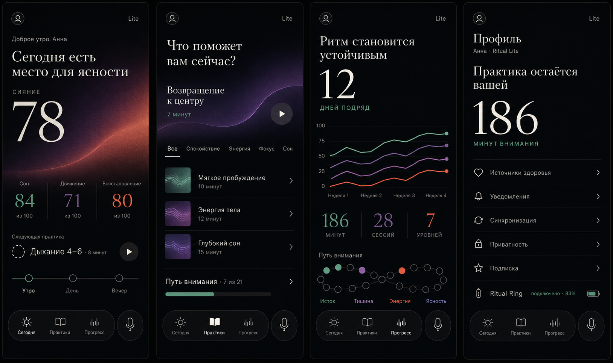
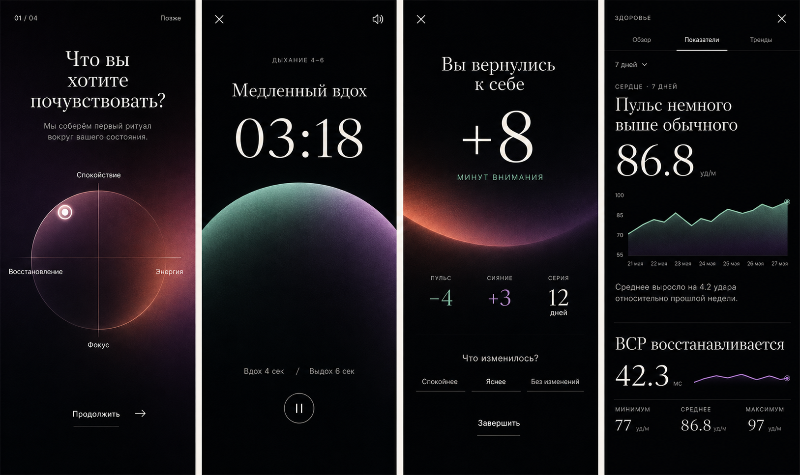
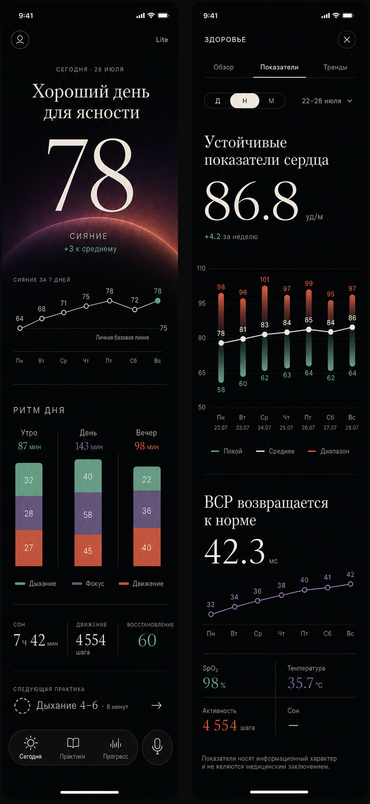
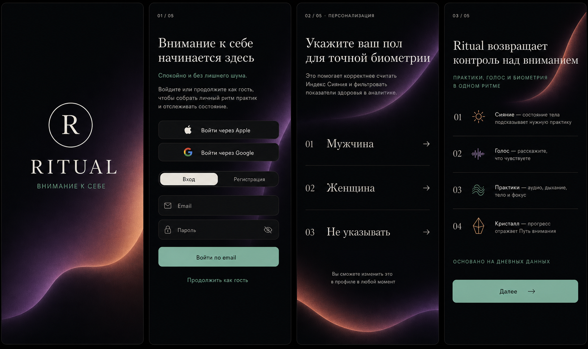
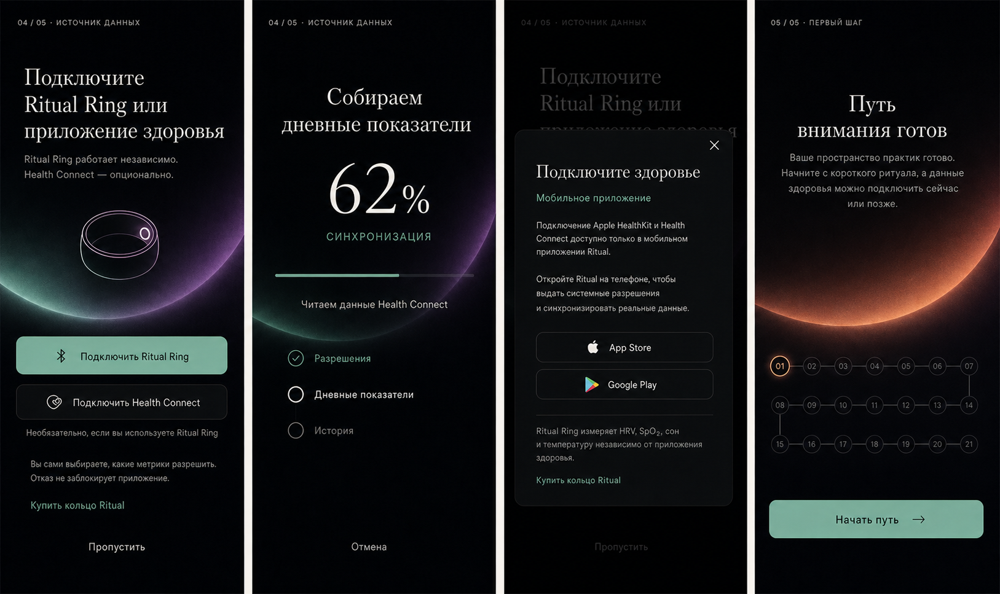
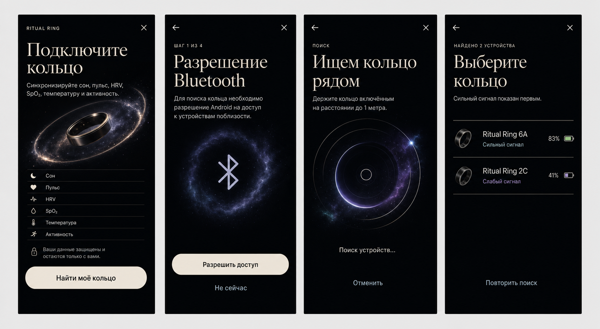
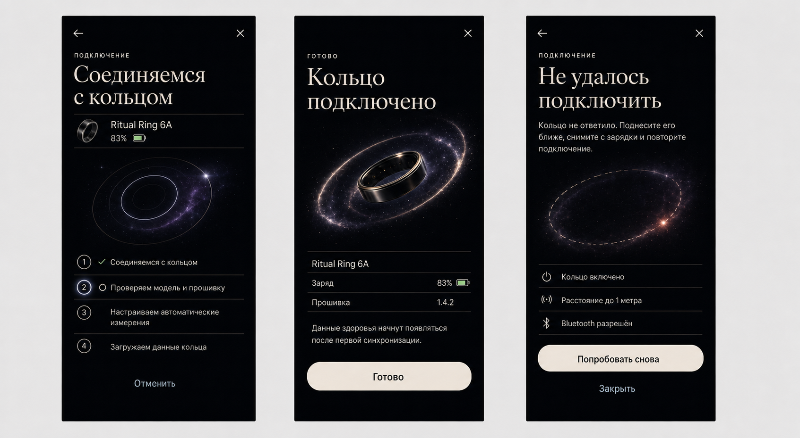

# Ritual — editorial nebula design system

Status: visual direction and implementation specification
Scope: mobile-first React/Capacitor application
Updated: 2026-07-27

## 1. Direction

Ritual should feel like a personal editorial report about attention, not a dashboard made from interchangeable cards.

The interface combines:

- a warm black continuous canvas;
- large editorial serif statements and numbers;
- precise sans-serif controls and labels;
- controlled mesh-nebula artwork with analog grain;
- crisp, reproducible data graphics;
- generous negative space and hairline separators.

The core content pattern is:

1. **Conclusion** — one human sentence that explains the state.
2. **Value** — one dominant number or phase.
3. **Evidence** — a chart, comparison, or short group of factors.
4. **Meaning** — one concise interpretation.
5. **Action** — one obvious next step.

Avoid turning every piece of content into a rounded card. Separation should usually come from spacing, hierarchy, alignment, and a 1 px divider.

## 2. Reference screens

### Core tabs

Includes:

- Today;
- Practices;
- Progress;
- Profile.

### Full-screen flows and details

Includes:

- onboarding intention selection;
- active breathing practice;
- practice completion;
- health metric detail.

### Focused Today and Health metrics direction

This board is the preferred detailed reference for the Today and Health `Показатели` screens. It clarifies how editorial typography and charts coexist:

- Today combines the Shine hero value, a seven-day line, and a stacked day-rhythm chart;
- Health uses daily resting/range columns with an average line, followed by a separate HRV trend;
- charts remain directly on the continuous canvas rather than inside dashboard cards;
- each color represents a defined metric or activity category.

The images are direction references, not pixel-perfect production specifications. Real copy, safe areas, accessibility, and data availability take precedence.

## 3. Product principles

### 3.1 One visual thesis per screen

Every screen gets one primary visual statement. Examples:

- “Сегодня есть место для ясности”;
- “Ритм становится устойчивым”;
- “Пульс немного выше обычного”;
- “Вы вернулись к себе”.

Do not place several competing hero blocks on one viewport.

### 3.2 Data should explain, not decorate

Charts must answer a specific question:

- What changed?
- Compared with what?
- Over which period?
- Is this good, neutral, or worth attention?
- What should the person do next?

Never use a chart when a number plus one sentence communicates the result better.

### 3.3 Nebula is a branded data atmosphere

Nebula is not space illustration and not AI smoke. It is a controlled brand asset constructed from:

- two or three low-frequency mesh-gradient color regions;
- a simple curved mask or horizon;
- 3–5% monochrome grain;
- optional subtle posterization at color transitions;
- a dark crop that preserves text contrast.

Nebula may appear:

- behind one hero value;
- underneath a chart fill;
- as the artwork for a featured practice;
- as the breathing surface in a player.

Nebula must not appear:

- behind every list row;
- inside every metric;
- as stars, particles, galaxies, lightning, or smoke tendrils;
- where it reduces numerical legibility.

## 4. Foundations

### 4.1 Color tokens

Use the following target palette. Existing CSS variables in `src/index.css` can be migrated gradually.

| Token | Value | Purpose |
| --- | --- | --- |
| `--ritual-bg` | `#08090A` | Main continuous canvas |
| `--ritual-surface` | `#101113` | Navigation and rare raised controls |
| `--ritual-ink` | `#F2EFE8` | Primary text and hero values |
| `--ritual-ink-70` | `rgba(242,239,232,.70)` | Secondary text |
| `--ritual-ink-42` | `rgba(242,239,232,.42)` | Metadata and unavailable labels |
| `--ritual-line` | `rgba(242,239,232,.12)` | Hairline separators |
| `--ritual-mint` | `#74B6A0` | Recovery, positive trend, Istok |
| `--ritual-violet` | `#76668E` | HRV, silence, focus, Tishina |
| `--ritual-coral` | `#C56855` | Load, attention, energy |
| `--ritual-amber` | `#C59A55` | Activity and warm emphasis |
| `--ritual-plum` | `#34243F` | Nebula depth |

Rules:

- use no more than two accents in one hero visualization;
- reserve off-white for the dominant conclusion/value;
- color is semantic, not ornamental;
- red and green trend arrows must always include direction or text, never color alone.

### 4.2 Typography

The required families already exist in `src/index.css`:

- `Inter` — UI, labels, tabs, units, supporting copy;
- `Playfair Display` — editorial headings when compact proportions are needed;
- `Cormorant Garamond` — large statements, timers, and hero values.

Recommended roles:

| Role | Family | Size | Line height | Notes |
| --- | --- | --- | --- | --- |
| Editorial statement | Cormorant Garamond | 40–48 px | .94–1.02 | 2–3 lines maximum |
| Hero value | Cormorant Garamond | 88–120 px | .8–.9 | Tabular alignment where possible |
| Section title | Playfair Display | 28–34 px | 1.05 | Use sparingly |
| Screen title | Inter | 24–28 px | 1.1 | Navigation-level title |
| Body | Inter | 15–17 px | 1.45 | Human interpretation |
| Metric value | Inter or Cormorant | 30–48 px | 1 | Match hierarchy |
| Label / eyebrow | Inter | 10–12 px | 1.2 | Uppercase, tracking .12em–.18em |
| Control label | Inter | 9–13 px | 1.2 | Never below 9 px |

Typography rules:

- serif communicates meaning and state;
- sans-serif communicates control and measurement;
- units are smaller and visually attached to the value;
- do not center long paragraphs;
- use Russian sentence case for conclusions and uppercase only for short eyebrows.

### 4.3 Grid and spacing

- Base grid: 4 px.
- Page margins: 20 px on small phones, 24 px on wider phones.
- Primary vertical rhythm: 24 / 32 / 48 px.
- Minimum touch target: 44 × 44 px.
- Main content max width: existing `max-w-md` behavior.
- Hairlines: 1 px at 8–12% white.
- Standard safe-area handling remains mandatory.

Avoid nested padding. A section should usually align to the same page columns as the sections above and below it.

### 4.4 Shape

Most content is unboxed. Rounded containers are reserved for:

- bottom navigation;
- the separate microphone action;
- segmented controls;
- modal surfaces and explicit selection controls;
- a single primary button when a text action is not sufficient.

Recommended radii:

- navigation pill: 999 px;
- compact control: 16–20 px;
- modal sheet: 28–32 px at the exposed edge;
- practice thumbnail: 8–12 px.

Do not use a 20–24 px radius on every section.

## 5. Navigation

The current project navigation is a product invariant.

### Main bottom navigation

- Floating 52 px pill.
- Exactly three destinations:
  - Sun — `Сегодня`;
  - BookOpen — `Практики`;
  - Activity — `Прогресс`.
- Separate 52 × 52 circular microphone button on the right.
- Active tab is off-white; inactive tabs are approximately 60% white.
- Profile is opened from the top user button and is never a fourth bottom tab.

### Full-screen flows

Practice player, onboarding, health details, and modal tools do not show the bottom navigation. They use close/back controls and preserve safe-area spacing.

## 6. Screen specifications

### 6.1 Today

Order:

1. User control and Lite/Plus status.
2. Personal greeting.
3. Editorial daily conclusion.
4. Shine value and restrained nebula horizon.
5. Three causal factors: sleep, movement, recovery.
6. Next practice row.
7. Morning/day/evening timeline.
8. Bottom navigation.

The shine score is a summary, not a medical diagnosis. If source data is incomplete, show the missing factor explicitly instead of inventing a value.

### 6.2 Practices

Order:

1. Editorial intention question.
2. One featured practice with branded nebula artwork.
3. Text filters with underline selection.
4. Editorial list of practices with hairline dividers.
5. Path of Attention progress row.

Practice thumbnails may use small mesh assets. Reuse a finite authored set rather than generating a unique texture at runtime.

### 6.3 Progress

Order:

1. Human conclusion about rhythm.
2. Streak hero value.
3. Four-week trend chart.
4. Total minutes, sessions, and completed levels.
5. 21-node Path of Attention visualization.

The path graphic must communicate completed, current, and locked states without relying on color alone.

### 6.4 Profile

Profile remains an `ActiveTab`, opened from the top user button.

Order:

1. Account identity and tier.
2. Personal ownership/privacy statement.
3. Total attention time.
4. Settings rows with dividers.
5. Connected device and battery status.
6. Existing bottom navigation with no invented Profile destination.

### 6.5 Onboarding

Each onboarding page asks one question only. Use one large interaction surface and one action. Progress remains visible (`01 / 04`).

The intention selector should support keyboard/screen-reader alternatives; the visual two-axis map cannot be the only input method.

### 6.6 Practice player

The player removes all nonessential navigation.

Priority:

1. phase instruction;
2. timer;
3. breathing/movement visual;
4. phase durations;
5. pause/continue;
6. close and audio controls.

The nebula breathing form should animate through scale, crop, and gradient position. Avoid particle systems and high-frequency motion.

### 6.7 Completion

Show the completed duration first, then only outcomes supported by real data. Reflection choices are text controls, not decorative cards.

### 6.8 Health

Health is a full-screen modal with:

- title and close control;
- tabs `Обзор / Показатели / Тренды`;
- optional period control `Сегодня / 7 дней / 30 дней`;
- one selected metric per detailed view.

Use the narrative order:

1. conclusion;
2. value;
3. chart;
4. comparison;
5. recommendation or related metric.

Never give equal visual weight to available data, unavailable data, and the selected metric.

## 7. Data visualization

### 7.1 General rules

- Charts should be SVG or Canvas generated from real values.
- Nebula may be a clipped background fill, never the data line itself.
- Use 2 px primary strokes and 1 px secondary strokes.
- Label the period and comparison baseline.
- Prefer direct labels over legends.
- Use at most four series; default to one or two.
- Empty states replace the chart with an explanation and next step.

### 7.2 Recommended chart mapping

| Data | Visualization |
| --- | --- |
| Heart rate / HRV / recovery | Line chart plus personal baseline |
| Sleep stages | Stacked columns only on sleep detail |
| Shine factors | Organic radar/blob or three direct factors |
| Practice rhythm | Weekly lines or dot matrix |
| Path progress | 21 discrete nodes grouped by chapter |
| Single-day goal | Large number with compact progress line |

### 7.3 Health language

- Say “выше вашей обычной линии”, not “плохо”.
- Say “данных пока недостаточно”, not “ошибка”.
- Always retain the existing non-medical disclaimer.
- Do not imply causation when the product only has correlation.

## 8. Motion and haptics

Motion should feel slow, physical, and interruptible.

- Screen fade: 240–320 ms.
- Content reveal: 320–480 ms, 8–12 px vertical distance.
- Chart draw: 600–900 ms only on first appearance.
- Nebula drift: 12–24 s loop, maximum 2–3% translation.
- Breathing scale follows the actual breathing phase.
- Respect `prefers-reduced-motion` and disable decorative drift.

Use haptics only for:

- phase change;
- successful completion;
- explicit selection;
- timer start/pause.

## 9. Accessibility

- Target WCAG AA contrast for all functional text.
- Minimum body text: 15 px; minimum control label: 9 px only with strong contrast.
- Provide accessible names for icon-only buttons.
- Never encode health state by color alone.
- Charts need a textual summary and accessible table/list equivalent.
- Large serif display type must not contain critical controls.
- Dynamic type may replace the intended composition; content must remain usable.

## 10. Implementation guidance

### 10.1 Suggested component primitives

- `EditorialStatement`
- `HeroMetric`
- `NebulaField`
- `MetricFact`
- `MetricRow`
- `EditorialList`
- `HairlineSection`
- `PeriodSegment`
- `TrendLineChart`
- `PathNodes`
- `MainBottomNavigation`

Build primitives before redesigning every screen. This keeps type scale, spacing, and data states consistent.

### 10.2 Nebula assets

Preferred implementation order:

1. authored WebP/AVIF texture with dark background and grain;
2. CSS mesh gradients plus a small reusable grain overlay;
3. Canvas only when subtle animation materially improves the experience.

Assets should be limited, named semantically, and reused:

- `nebula-clarity-plum-coral`;
- `nebula-recovery-mint-plum`;
- `nebula-focus-violet-navy`;
- `nebula-energy-coral-amber`.

### 10.3 Migration strategy

1. Add new design tokens without deleting current variables.
2. Build typography, metric, separator, and navigation primitives.
3. Redesign Today and Health first; they establish the system.
4. Apply the system to Progress and Practices.
5. Update Player, Completion, and Onboarding.
6. Remove superseded glass-card styles only after all consumers migrate.

Do not change data contracts, navigation behavior, notification flows, or health permissions as part of a visual-only migration.

## 11. Definition of done

A redesigned screen is ready when:

- it has one clear visual thesis;
- the primary number and conclusion are understood within three seconds;
- all data comes from existing app state or a defined empty state;
- the actual Ritual navigation is preserved;
- nebula is restrained and does not reduce contrast;
- no unnecessary card wrapper remains;
- charts have labels, comparison context, and a text summary;
- safe areas, reduced motion, and touch targets are verified;
- the screen remains usable without the nebula asset loading.

## 12. Onboarding

The onboarding is one continuous editorial introduction, not a stack of dashboard cards. Each screen has one statement, one dominant visual idea, and one primary action. Nebula imagery is most visible around the product promise, health connection, and Ritual Ring states; forms and permission explanations remain quieter for clarity.

### 12.1 Main flow

1. **Splash** — RITUAL mark and the line “внимание к себе”; automatic transition after 1.5 seconds.
2. **Authentication** — product promise, Apple/Google where supported, email login or registration, and guest continuation.
3. **Biometry** — gender selection with a clear “Не указывать” option and an explanation that it can be changed later.
4. **Product promise** — Сияние, Голос, Практики, and Кристалл introduced as an editorial sequence rather than four boxed feature cards.

### 12.2 Health connection and completion

5. **Health source** — choose Ritual Ring, Apple Health / Health Connect, purchase a ring, or skip.
6. **Synchronization** — visible progress and calm explanation while health data is imported.
7. **Unsupported web state** — honest platform limitation with a direct route to continue.
8. **Path introduction** — final “Путь внимания” statement and the action “Начать путь”.

### 12.3 Ritual Ring connection wizard

The early wizard states are: introduction, Bluetooth permission, nearby scan, and device selection. They use a shared orbital metaphor so progress feels connected without turning each step into a decorative illustration.

The remaining states are: staged connection, successful connection, and recoverable error. Error copy stays practical and non-alarming; success includes the device identity, battery, firmware, and what happens next.

### 12.4 Onboarding rules

- No bottom navigation appears inside onboarding or connection wizards.
- Keep every screen full-height and scroll only when accessibility text scaling requires it.
- Use one primary cream action per screen; secondary actions are text-only.
- Place close and back controls consistently within safe areas.
- Never rely on nebula imagery to communicate status; permission, progress, success, and error must remain understandable with imagery disabled.
- Platform-specific labels and available providers come from runtime state, not from decorative mock data.
